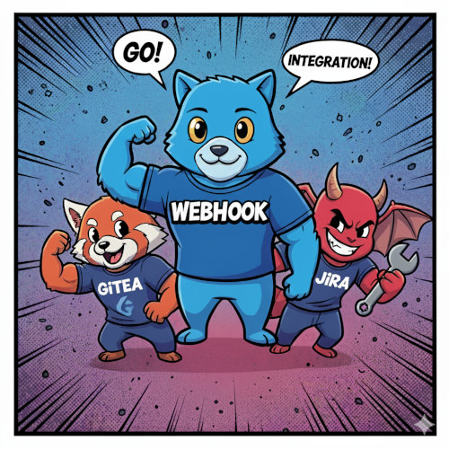

# Go Gitea Jira Webhook

A Go application that receives webhooks from Gitea and automatically adds comments to Jira tickets when commits reference ticket IDs.



## Features

- Receives Gitea push webhooks
- Extracts Jira ticket IDs from commit messages using regex pattern `\b([\$#]?[A-Z]+-[0-9]+)\b`
- **Public Comment Override**: Use `$TICKETID` or `#TICKETID` format to force public visibility
- Automatically adds comments to Jira tickets with commit links
- **Commit Buffering**: Optional buffering to reduce comment spam by batching commits over a configurable time period
- **Service Overview**: Web-based configuration overview available via HTTP GET to root path
- **IP Restrictions**: Optional CIDR-based IP filtering for webhook POST requests
- Supports HMAC signature verification for webhook security
- Configurable via TOML configuration file
- HTTPS/TLS support

## Configuration

The application expects a TOML configuration file. The configuration file path is determined in the following order of precedence:

1. Command line flag: `-config /path/to/config.toml`
2. Default location: `/etc/gitea-jira-webhook/config.toml`

Example configuration:

```toml
[jira]
api_url = "https://your-jira-instance.atlassian.net/rest/api/3"
username = "your-jira-username"
password = "your-jira-password"
projects_filter = ["PROJECTFOO", "PROJECTBAR"]  # Optional: Only process tickets from these projects

[gitea]
webhook_secret = "your-webhook-secret"  # Optional

[ssl]
cert_file = "/path/to/cert.pem"
key_file = "/path/to/key.pem"

[server]
port = "8443"

[buffering]
duration = "10m"   # Optional: buffer duration (e.g., "5s", "10m", "1h") - if set, buffering is enabled
```

### Configuration Options

#### Jira Section

- **api_url**: The base URL of your Jira instance with REST API path
- **username**: Your Jira username
- **password**: Your Jira password (used to create API tokens automatically)
- **projects_filter**: (Optional) Array of Jira project codes to process. If empty or omitted, all projects will be processed.
- **comment_visibility**: (Optional) Set comment visibility. Format: "type:value" (e.g., "role:Members", "group:developers"). If empty, comments will be public.

**Public Comment Override**: Use `$TICKETID` or `#TICKETID` format in commit messages (e.g., `$PROJ-123` or `#PROJ-123`) to force public visibility, bypassing the `comment_visibility` setting for that specific ticket.

#### Buffering Section

- **duration**: (Optional) Buffer duration in Go duration format (e.g., "5s", "10m", "1h"). If set, buffering is automatically enabled.

When a duration is configured, the application collects all commits for each Jira ticket over the specified duration before posting a single comment. This prevents comment spam when multiple commits are pushed in quick succession (e.g., during debugging, typo fixes, or rapid development).

**How buffering works:**

1. First commit for a ticket starts the buffer timer
2. Additional commits for the same ticket are added to the buffer
3. After the buffer duration expires, all buffered commits are posted as a single comment
4. On graceful shutdown (SIGINT/SIGTERM), all pending buffered commits are immediately processed

#### Project Filtering Examples

Process only specific projects:

```toml
[jira]
api_url = "https://your-jira-instance.atlassian.net/rest/api/3"
username = "your-jira-username"
password = "your-jira-password"
projects_filter = ["PROJECTFOO", "PROJECTBAR"]  # Only process tickets from these projects
```

Process all projects (default behavior):

```toml
[jira]
api_url = "https://your-jira-instance.atlassian.net/rest/api/3"
username = "your-jira-username"
password = "your-jira-password"
# projects_filter is omitted - all projects will be processed
```

**Note**: The application will automatically create a Jira API token using your username and password at startup. The API token is generated dynamically and used for all subsequent Jira API calls. Tokens are cached locally and automatically renewed when they expire or are near expiration (within 7 days).

#### Server Section

- **port**: Server port number (default: 8443)
- **allowed_cidrs**: (Optional) Array of CIDR ranges to restrict webhook POST requests. If configured, only requests from these IP ranges will be accepted.

**IP Restriction Examples:**

```toml
[server]
port = "8443"
allowed_cidrs = ["192.168.1.0/24", "10.0.0.0/8"]  # Only allow from private networks
```

```toml
[server]
port = "8443"
allowed_cidrs = ["203.0.113.0/24"]  # Only allow from specific public subnet
```

```toml
[server]
port = "8443"
# allowed_cidrs is omitted - all IPs are allowed (default behavior)
```

**Security Benefits:**

- Prevents unauthorized webhook abuse from unknown sources
- Restricts access to known Gitea server IP ranges
- Provides helpful error messages with HTTP 403 Forbidden for blocked IPs
- Logs all blocked attempts for security monitoring

### Token Management

The application includes intelligent token management:

- **Automatic Creation**: Creates Jira Personal Access Tokens (90-day expiry) using username/password
- **Local Caching**: Stores tokens securely in `/tmp/go-gitea-jira-webhook-token.cache`
- **Expiration Checking**: Proactively checks if tokens expire within 7 days
- **Periodic Renewal**: Background process checks token expiration every hour during runtime
- **Automatic Renewal**: Refreshes tokens before they expire or when API calls return 401 Unauthorized
- **Runtime Recovery**: If a token expires during operation, the next API call will automatically trigger renewal

**Token Lifecycle:**

1. **Startup**: Check cached token, renew if near expiration (within 7 days)
2. **Runtime**: Background checker runs every hour to proactively renew tokens
3. **On-Demand**: Failed API calls (401 Unauthorized) trigger immediate renewal
4. **Long-Running**: Service can run indefinitely without manual token management

## Building

### Build with Version Information

To build the binary with build time and version information:

```bash
BUILDTIME=$(date -u '+%Y-%m-%d_%H:%M:%S') BUILDVERSION="$(git describe --tags)" && go build -race -ldflags "-X main.buildtime=$BUILDTIME -X main.buildversion=${BUILDVERSION}" && ./go-gitea-jira-webhook -version
```

### Standard Build

```bash
go build
```

## Version Information

To check the version of the built binary:

```bash
./go-gitea-jira-webhook -version
```

## Refreshing Go Modules

To refresh and update all Go modules:

```bash
rm go.??? ; rm -rf vendor ; go mod init ; go get -u && go mod tidy && go mod vendor ; echo GOREFRESH
```

## Usage

### Command Line Options

```bash
./go-gitea-jira-webhook [options]
```

Available options:

- `-version` - Show version information
- `-help` - Show help information with all available options and their defaults
- `-config string` - Path to configuration file (default: "/etc/gitea-jira-webhook/config.toml")

Examples:

```bash
# Show help
./go-gitea-jira-webhook -help

# Show version
./go-gitea-jira-webhook -version

# Use custom config file
./go-gitea-jira-webhook -config /path/to/my-config.toml

# Run with default settings
./go-gitea-jira-webhook
```

### Setup Steps

1. Configure your TOML configuration file
2. Build the binary using the build command above
3. Run the application:
   ```bash
   ./go-gitea-jira-webhook
   ```
4. Configure your Gitea repository webhook to point to: `https://your-server:8443/gitea-webhook`
5. Access the service overview at: `https://your-server:8443/` (GET request)

### Service Overview

The service provides a web-based configuration overview accessible via HTTP GET request to the root path (`/`). This overview displays:

- **Service Status**: Current build version and build time
- **Configuration Settings**: Jira URL, username, project filters, comment visibility settings
- **Buffering Status**: Whether commit buffering is enabled and the configured duration
- **Security Settings**: Webhook signature verification status
- **Special Features**: Documentation of $TICKETID override and other features
- **API Endpoints**: Available HTTP endpoints and their purposes
- **Usage Instructions**: How to configure webhooks and format commit messages

Simply navigate to `https://your-server:8443/` in a web browser to view the current service configuration and status.

## How It Works

1. Gitea sends a webhook POST request to `/gitea-webhook` endpoint
2. The application verifies the webhook signature (if configured)
3. Extracts commit messages from the push event
4. Searches for Jira ticket IDs in commit messages using regex
5. Checks for public visibility override (`$TICKETID` format)
6. Bundles multiple commits referencing the same ticket ID together
7. For each ticket ID, adds a single comment to the Jira ticket with:
   - **Single commit**: Link to the commit, commit message (truncated if too long), repository information
   - **Multiple commits**: List of all commits with links, commit messages, and repository information

### Public Visibility Override

You can force a comment to be public (bypassing the `comment_visibility` setting) by using the `$TICKETID` or `#TICKETID` format in your commit messages:

- **Normal format**: `PROJ-123` - Uses configured visibility settings
- **Public format**: `$PROJ-123` or `#PROJ-123` - Forces comment to be public

Examples:

```bash
# This commit will use configured visibility (e.g., role:Members)
git commit -m "Fix login bug for PROJ-123"

# These commits will force public visibility, ignoring comment_visibility setting
git commit -m "Fix login bug for $PROJ-123"
git commit -m "Fix login bug for #PROJ-123"  # Alternative format (bash-safe)

# Mixed usage - the entire ticket comment will be public if ANY commit uses $ or #
git commit -m "Fix login bug for PROJ-123 and #PROJ-456"
```

**Note**: If any commit referencing a ticket uses the `$` or `#` prefix, the entire bundled comment for that ticket will be public. The `#` format is recommended when working in bash environments to avoid variable expansion issues.

### Commit Bundling

The application intelligently bundles multiple commits that reference the same Jira ticket into a single comment:

- **Multiple commits → One comment**: If commits `abc123`, `def456`, and `ghi789` all reference `PROJ-123`, only one comment is created on `PROJ-123` containing all three commits
- **Cross-ticket references**: If commit `abc123` references both `PROJ-123` and `PROJ-456`, separate comments are created for each ticket
- **Project filtering**: Only commits referencing tickets from allowed projects (if configured) are processed
- **Chronological ordering**: Commits are automatically sorted by timestamp (oldest first) in multi-commit comments

Example comment formats:

**Single commit:**

```
Associated Gitea Commit: Fix authentication bug (abc1234)
Commit URL: https://git.example.com/repo/commit/abc1234
Commit Date: 2025-09-12 14:30:25 UTC
Repository: my-repo (https://git.example.com/repo)
```

**Multiple commits:**

```
Associated Gitea Commits (3 commits):
Repository: my-repo (https://git.example.com/repo)

1. Fix authentication bug (abc1234)
   https://git.example.com/repo/commit/abc1234
   2025-09-12 14:30:25 UTC

2. Update documentation (def5678)
   https://git.example.com/repo/commit/def5678
   2025-09-12 15:45:10 UTC

3. Add unit tests (ghi9012)
   https://git.example.com/repo/commit/ghi9012
   2025-09-12 16:20:33 UTC
```

## Security

- Webhook signature verification using HMAC-SHA256
- HTTPS/TLS required for all communications
- Automatic API token generation from username/password at startup
- API tokens are created with unique names and timestamps for tracking
- Intelligent token renewal with 7-day expiration window
- Secure token caching with appropriate file permissions (0600)
- Automatic recovery from token expiration during runtime

**Important Security Notes**:

- Store your Jira password securely in the configuration file
- Ensure proper file permissions (e.g., `chmod 600`) on the config file
- The application creates temporary API tokens that are used for the session
- Consider using environment variables for sensitive configuration values

## License

[Add your license information here]
